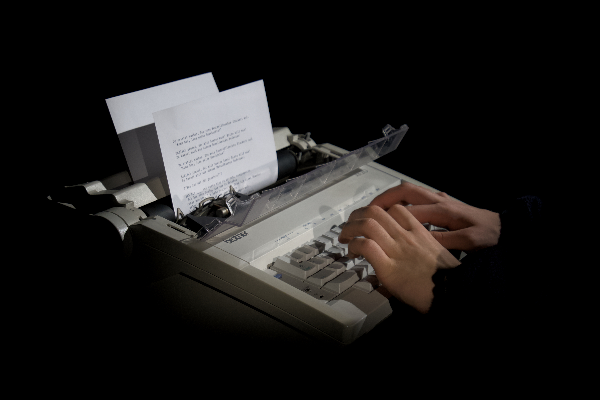
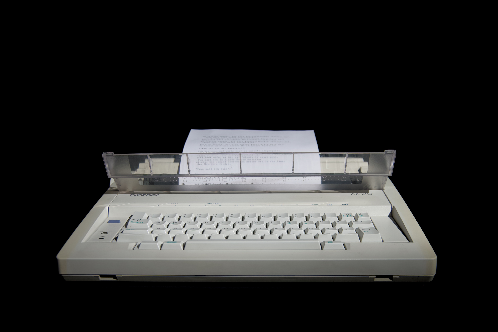
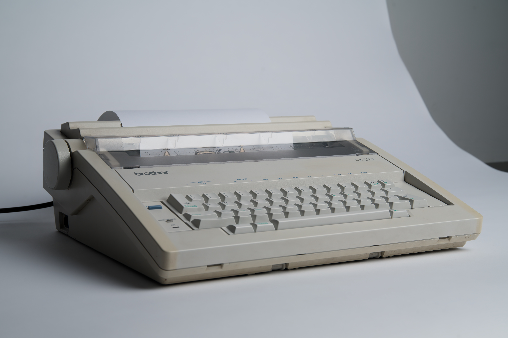
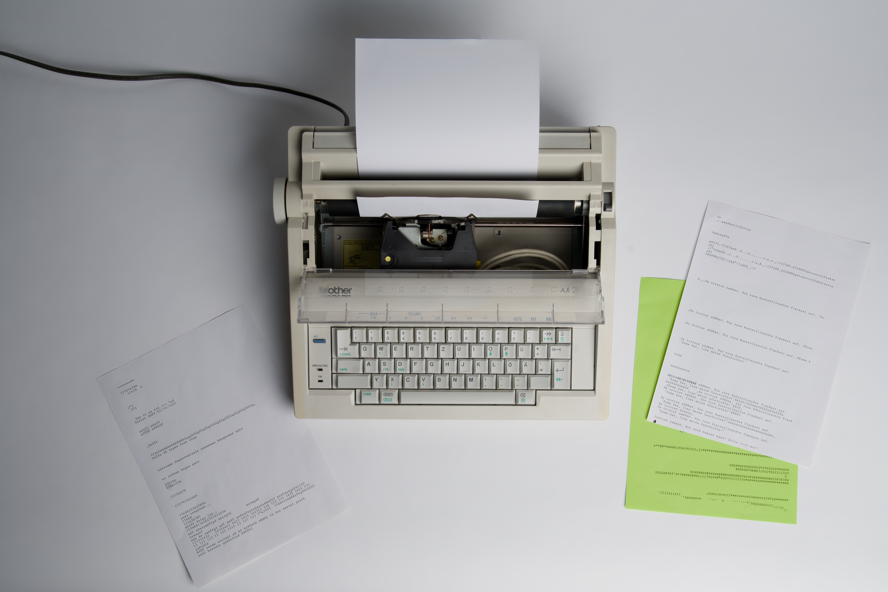
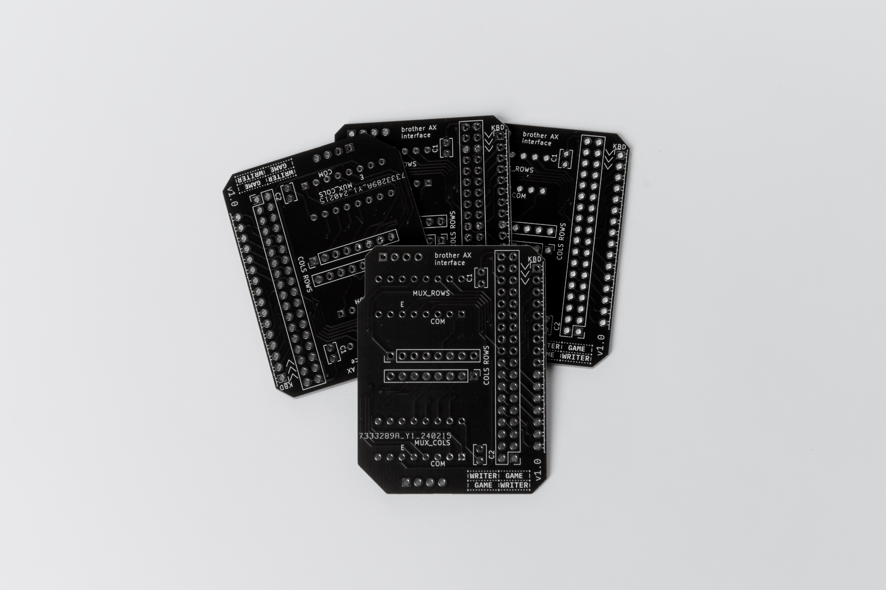
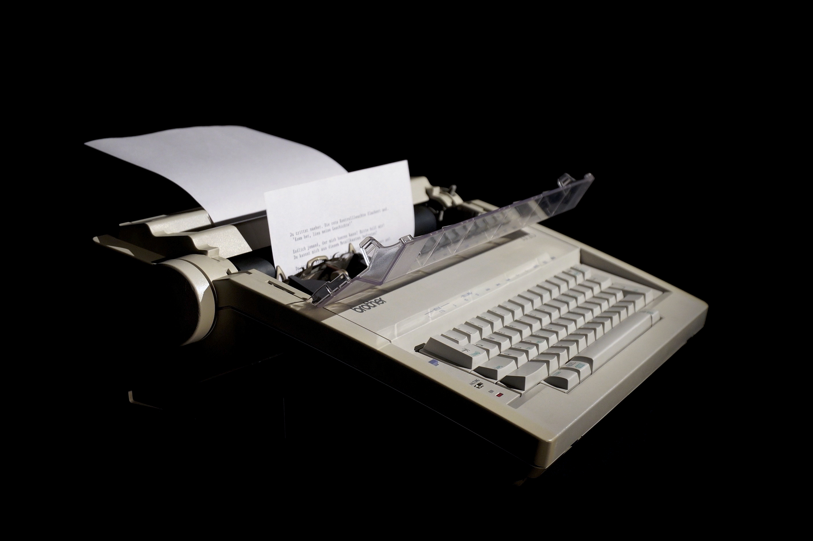

# Game Writer Writer Game 

## Abstract
Writer Game is an interactive installation. It consists of an electric typewriter that, with the help of an Arduino, functions not only as an input device but also as an output device. This makes it possible to play a text-based game inspired by classic text adventures using the typewriter, in which players must solve puzzles.

The installation reconstructs a dialogue between human and machine. Players can control the game through text input and receive the machine’s responses as printed output.

## Starting Point
The starting point for this project is an electric typewriter by Brother (Brother AX-210), which we date to the early 1990s.

## Limitations

The limitations of this project span three axes:

- The text-based game severely restricts interaction with the game. Any graphical visualization can only be implemented using ASCII art.

- The typewriter serves as an interesting medium to emphasize this first limitation.

- The game runs on a microcontroller (ATmega2560). The technical constraints therefore directly affect the development process.

## Typewriter–Microcontroller Interface
The Arduino board acts as the central interface between the typewriter and the game. The microcontroller must be able to process keyboard inputs as well as print the game’s outputs using the typewriter.

To achieve this, an interface designed as a PCB was developed. This interface is connected to both the original keyboard and the keyboard input of the typewriter. This allows keystrokes to be passed to the machine’s mainboard, which then prints them onto paper using the type wheel.

## Text Adventure Game: WRITER GAME
The first prototype of the game was developed in Python and later adapted as a template for the final version implemented on the Arduino in C/C++.

The game code consists of various rooms. Depending on whether a puzzle is solved successfully, the game transitions to different subsequent rooms, resulting in a non-linear game flow. The rooms themselves are stored in arrays and reference the current and next room via corresponding indices.

Because the Arduino provides less functionality than Python, a custom implementation for string comparison had to be created to solve the puzzles. Another important aspect of the implementation was the correct handling of pointers in order to reference the appropriate objects and variables.

Finally, memory optimization became necessary because the global variable memory was exhausted. This issue was resolved by using flash memory.

## Story
Our motivation for this project was to make a game playable without a display (a conventional pixel-based display). We developed a story and puzzles tailored to the typewriter and implemented them in the form of a text-based game.

In the game, players solve puzzles by communicating with the typewriter. The plan is to further develop the game and the typewriter into a larger installation, enhanced with audio and lighting elements. Elements from the game are also intended to be represented physically (such as flea market stalls, which also appear in the game).

 